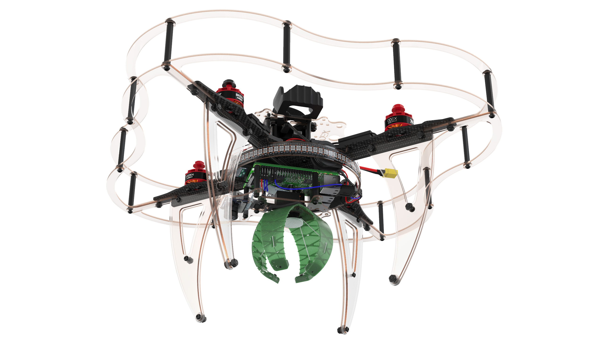

# Сборка Клевера 4

В данной инструкции рассматривается сборка комплекта COEX Clever 4.

> **Caution** Перед использованием паяльного оборудования обязательно ознакомьтесь с [техникой безопасности при пайке](tb.md).

## Дополнительное оборудование

## Сборка основы для рамы

1. Совместить 2 карбоновые пластины жесткости, используя центральные пазы.
2. Используя пазы, установить сверху карбоновую центральную деку.

