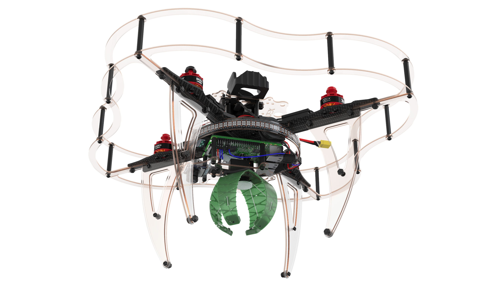

# Сборка Клевера 4

В данной инструкции рассматривается сборка комплекта COEX Clever 4.

> **Caution** Перед использованием паяльного оборудования обязательно ознакомьтесь с [техникой безопасности при пайке](tb.md).

## Дополнительное оборудование

## Сборка основы для рамы

1. Совместить 2 карбоновые пластины жесткости, используя центральные пазы.

2. Используя пазы, установить сверху карбоновую центральную деку.

3. Стянуть конструкцию с помощью винтов М3х8 и стальных гаек, установленых в пазах пластин.

## Установка моторов

1. Распаковать моторы.
2. Используя ножницы, укоротить провода на моторах:
    * Обрезать половину длины (оставив 30 мм).
    * Зачистить (снять 5 мм изоляции с конца провода, не повредив медные жилы).
    * Скрутить провода.
    * [Залудить провода](zap.md), используя пинцет.

## Состав набора

## Дополнительное оборудование

