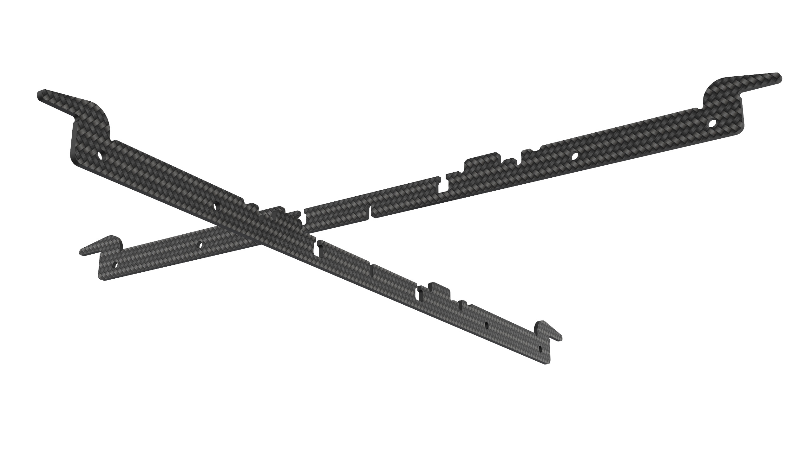
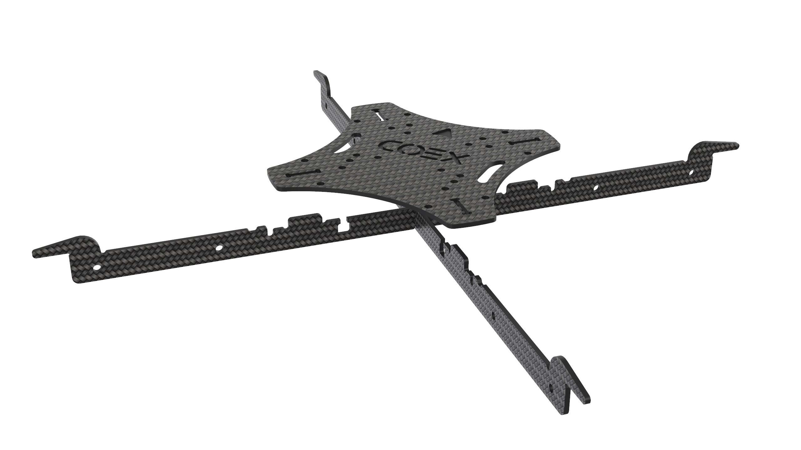

# Сборка Клевера 4

В данной инструкции рассматривается сборка комплекта COEX Clever 4.

> **Caution** Перед использованием паяльного оборудования обязательно ознакомьтесь с [техникой безопасности при пайке](tb.md).

## Дополнительное оборудование

## Сборка основы для рамы

1. Совместить 2 карбоновые пластины жесткости, используя центральные пазы.

2. Используя пазы, установить сверху карбоновую центральную деку.

3. Стянуть конструкцию с помощью винтов М3х8 и стальных гаек, установленых в пазах пластин.

## Установка моторов

1. Распаковать моторы.
2. Используя ножницы, укоротить провода на моторах:
    * Обрезать половину длины (оставив 30 мм).
    * Зачистить (снять 5 мм изоляции с конца провода, не повредив медные жилы).
    * Скрутить провода.
    * [Залудить провода](zap.md), используя пинцет.
3. Установить мотор на луч.
4. Прикрепить мотор к лучу винтами М3х5, используя шестигранный ключ.

## Сборка рамы:
1. Установить 4 луча с моторами на базу рамы, используя пазы, согласно схеме вращения моторов (обратить внимание на цвета гаек на моторах).
2. Зафиксировать лучи на раме, используя 8 винтов М3х8 и 6 стальных гаек, а также 2 стойки “мама-мама” 15 мм (см на рисунок).

## Монтаж платы распределения питания

1. [Залудить](zap.md) контактные площадки платы питания.
2. С помощью мультиметра проверить отсутствие контактного замыкания (прозвонить):
    * Выставить мультиметр в режим прозвона.
    * Проверить работу мультиметра путем замыкания щупов между собой. При корректной работе прибор издаст  характерный звук.
    * Попарно один щуп прикладывается к “+ ”контакту, а второй к “-” / ”GND”. Если в цепи есть короткое замыкание, издается звук.

## Монтаж PDB

1. Установить 4 стойки “папа-мама” 6 мм на центральную деку винтами М3х6.
2. Установить PDB на стойки.
3. Стрелки на PDB и центральной деке должны быть направлены в одну сторону

## Пайка регуляторов:

1. Припаять фазные провода (1) моторов к регуляторам.
2. Припаять силовые провода (2) регуляторов к контактным площадкам платы.
    * Красный к "+"
    * Черный к "-"

## Состав набора

## Дополнительное оборудование

