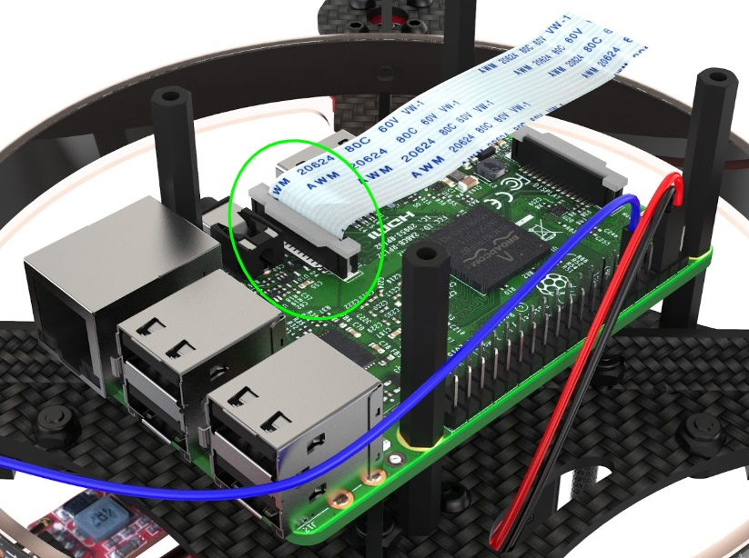

# **Сборка Клевера 4**

В данной инструкции рассматривается сборка комплекта COEX Clever 4.

> **Caution** Перед использованием паяльного оборудования обязательно ознакомьтесь с [техникой безопасности при пайке](tb.md).

# **Состав набора**
## **Электроника** 
1. **Моторы**
2. **Регуляторы оборотов (ESC)**
3. **Полётный контроллер**
4. **Raspberry**
5. **Камера**
6. **Лидар**
7. **ПДБ**
8. **Пульт дистанционного управления**
9. **Приёмник**
10. **Micro SD карта**
## **Конструктив**
1. **Центральная рама**
2. **Лучи**
3. **Дополнительная верхняя/нижняя рама**
4. **Ножки**
5. **Защита**
6. **Корпус для АКБ**
## **Крепежные элементы**
1. ***Винт М3х10, М3х8, М3х5, М2.5х8***
2. ***гайка М2.5, М3***
3. ***Саморезы М2***
4. ***Стойки 40, 20, 6мм папа-мама***
5. ***Хомуты, изолента, скотч ЗМ***
6. ***Проставка для ножек***
## **Другое**
1. ***Провода***
2. ***Шлейфы***
3. ***Разъёмы питания***
4. ***Захват, FPV***
## **Инструменты**
1. ***Паяльник***
2. ***Кусачки***
3. ***Отвертки (3 вида)***
4. ***Флюс, припой***
5. ***Ключ для пропеллеров***

### ***Дополнительное оборудование***
1. **Канцелярский нож**
2. **Мультиметр**
3. **Фен промышленный** (*Альтернативой промышленному фену при усадки может послужить пламя от зажигалки или нагретое жало паяльника*)
4. **Плоскогубцы**
5. **Пинцет**

## **Сборка основы для рамы**

1. Совместить 2 карбоновые пластины жесткости, используя центральные пазы.
2. Используя пазы, установить сверху карбоновую центральную деку.

3. Стянуть конструкцию с помощью винтов М3х8 и стальных гаек, установленых в пазах пластин.

## **Установка моторов**

1. Распаковать моторы.
2. Используя ножницы, укоротить провода на моторах:
    * Обрезать половину длины (оставив 30 мм).
    * Зачистить (снять 5 мм изоляции с конца провода, не повредив медные жилы).

    * Скрутить провода.
    * [Залудить провода](zap.md), используя пинцет.
3. Установить мотор на луч.
4. Прикрепить мотор к лучу винтами М3х5, используя шестигранный ключ.

## **Сборка рамы**
1. Установить 4 луча с моторами на базу рамы, используя пазы, согласно схеме вращения моторов.

*обратить внимание на цвета гаек на моторах*
##
2. Зафиксировать лучи на раме, используя 8 винтов М3х8 и 6 стальных гаек, а также 2 стойки "мама-мама" 15 мм (см на рисунок).

## **Монтаж платы распределения питания**

1. [Залудить](zap.md) контактные площадки платы питания.
2. С помощью мультиметра проверить отсутствие контактного замыкания (прозвонить):
    * Выставить мультиметр в режим прозвона.
    * Проверить работу мультиметра путем замыкания щупов между собой. При корректной работе прибор издаст  характерный звук.
    * Попарно один щуп прикладывается к "+" контакту, а второй к "-" / "GND". Если в цепи есть короткое замыкание, издается звук.

## **Монтаж PDB**

1. Установить 4 стойки "папа-мама" 6 мм на центральную деку винтами М3х6.

2. Установить PDB на стойки.
3. Стрелки на PDB и центральной деке должны быть направлены в одну сторону.

## **Пайка регуляторов и ВЕС**

1. Припаять фазные провода (1) моторов к регуляторам.
2. Припаять силовые провода (2) регуляторов к контактным площадкам платы.
    * Красный к "+"
    * Черный к "-"

3. Пайка BEC (2 шт):
    * Припаять силовые провода каждого BEC к контактным площадкам одного из регуляторов (красный к "+", черный к "-").

# **Сопряжение приёмника и пульта**
1. Подключить радиоприемник к разъему от BEC 5В.
2. Установить джампер на вход (B/VCC).
3. Подключить АКБ.
4. Светодиод на радиоприемнике должен мигать.

## 
1. На пульте зажать кнопку BIND KEY.
2. Включить пульт (перещелкнуть POWER, BIND KEY не отпускаем).

3. Ждем синхронизацию.
4. Отсоединить джампер.
5. Светодиод на приемнике горит непрерывно.

### ***Если пуль заблокирован***
Необходимо перевести все стики в начальное положение:
1. Левый стик в **центральной нижней позиции**. 
2. Правый стик в **центре**.
3. Переключатели A, B, C, D в положение **"От Себя"**.

## **Убедиться, что PPM в меню RX Setup отключен**
1. Для входа в МЕНЮ удерживаем нажатой кнопку "ОК".
2. Кнопками Up/Down выбираем меню "System setup", кнопкой "ОК" подтверждаем выбор.
3. Выбираем "RX Setup".
4. Выбираем "Output mode".
5. Убедиться, что в открывшемся меню выбран пункт "PWM".
6. Чтобы сохранить настройки, удерживаем нажатой кнопку "CANCEL".

## **Сборка**
1. Установить 4 стойки "папа-мама" 6 мм на PDB.
2. Подключить шлейф питания к PDB.
3. Установить поликарбонатную пластину на стойки и зафиксировать нейлоновыми гайками.

## **Установка полётного контроллера**
1. Установить полетный контроллер на пластину с помощью двухстороннего скотча.
2. Стрелки на полетном контроллере и центральной деке должны быть направлены в одну сторону.

3. Подключить шлейф питания PDB к разъему "POWER" полетного контроллера, закрутив его в "косичку" для взаимной фиксации проводов.

## **Сборка**
1. Установить 4 алюминиевые стойки 40 мм с помощью винтов М3х10.

2. Подключить сигнальные провода регуляторов к полетному контроллеру следующим образом:

3. Установить 2 стойки "мама-мама" 15 мм на центральную деку с помощью винтов М3х8
4. Другие 2 стойки крепятся винтами М3х10 при том, что фиксируют 2 карбоновые детали, помимо стойки.

## **Установка обруча для светодиодной ленты**
1. Согнуть поликарбонатную заготовку в обруч и зафиксировать ее концы в замке.
2. Установить обруч на раму, используя пазы.

## **Установка Raspberry**
1. Установить плату Raspberry на стойки, используя 4 стойки "папа-мама".
2. Протянуть провода от BEC через паз в центральной раме.

3. Подключить провод питания от BEC к Raspberry, согласно схеме:

## **Установка светодиодной ленты на обруч**
1. Проверить наличие напаянных пинов на контактах ленты (при отсутствии - напаять).
2. Установить светодиодную ленту на обруч (используя клеевой слой на ленте) так, чтобы контакты были в задней части коптера. Для фиксации использовать **стяжки**.

## **Подключение светодиодной ленты к Raspberry**
1. Питание для ленты берется от второго BEC. Необходимо подключить контакты "-" и "+" к "Ground" и "5v" на ленте соответственно. 
2. Контакт "D" можно подключить к любому свободному пину "GPIO" на Raspberry.

### *Пример подключения ленты:*

## **Установка шлейфа для камеры RPI**
1. Поднять защелку.
2. Подключить шлейф.
3. Закрыть защелку.

#### * ***Подготовить дальномер к монтажу, предварительно напаяв на него контакты***
## **Установка оборудования на нижнюю монтажную деку**
1. Установить камеру RPI на 4 самореза 2х5.
2. Установить на деку лазерный дальномер с помощью 2 винтов М3х8 и стальных гаек.

3. Установить приемник на нижнюю деку с помощью двухстороннего скотча.

4. Установить нижнюю деку с помощью 4 винтов М3х10.
5. Подключить шлейф к RPI камере.

## **Подключить лазерный дальномер к Raspberry с помощью проводов типа "мама-мама":** 
    * VCC разъем к 01 пину 3.3v.
    * GND разъем к 09 пину Ground.
    * SDA разъем к 03 пину Gpio02.
    * SCL разъем к 05 пину Gpio03.

## **Монтаж ножек**
1. Установить 8 ножек с помощью винтов М3х10 и стальных гаек, согласно рисунку
2. Установить демпфирующие прокладки на ножки с помощью винтов М3х10 и стальных гаек

## **Подключение шлейфов**
    * Подключить шлейф радиоприемника в "RCIN" разъем полетного контроллера.
    * Подключить шлейф к приемнику.

## **Сборка защиты винтов**
1. Собрать нижнюю часть защиты, используя 12 винтов М3х10 и 12 нейлоновых стоек 40 мм, согласно рисунку.
2. Установить верхнюю часть, используя 12 винтов М3х10, согласно рисунку.

3. Установить защиту на коптер, с помощью 4 винтов М3х10 и стальных гаек.

## **Установка верхней деки на коптер**
1. Установить на верхнюю деку держатель АКБ с помощью 4 винтов М3х8 и стальных гаек.
2. Продеть в пазы ремешок для фиксации АКБ.
3. Установить верхнюю деку на коптер с помощью 4 винтов М3х10.

## 
    * Подключить USB кабель к разъему на полетном контроллере и USB разъему Raspberry.
    * Зафиксировать "улитку" кабеля в удобном месте с помощью двухстороннего скотча так, чтобы провод не мешал вращению винтов.

# **Установка АКБ, проверка коптера**
***Важно, чтобы все провода были спрятаны и движению пропеллеров ничего не мешало:***

    * Балансировочный разъем АКБ должен быть спрятан под утягивающим ремешком.
    * Регуляторы должны быть зафиксированы хомутами.
    * Все провода, идущие от PDB и PIXRACER, должны быть зафиксированы велкро-липучкой, обмотанной вокруг алюминиевых стоек.

## 

## 

## **Аэродинамика**

## **Установка пропелеров и подготовка к полёту**
Установить 4 пропеллера, согласно схеме вращения. При установке пропеллеров АКБ должна быть отключена.

# **Дрон готов к полёту**

